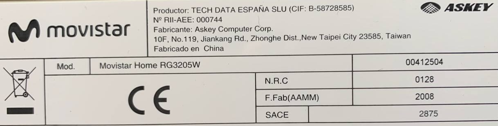
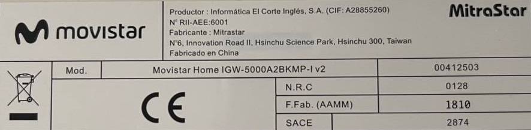

# Repurposing Movistar Home

as a Home Assistant dashboard panel.

[Versión en castellano](README.md)

Join our [Telegram group chat](https://t.me/movistar_home_hacking) for more information!

## Important note

Currently there are at least 2 different models of Movistar Home exist, check the sticker label on the bottom of your device to find out its model.

### `RG3205W`

Manufactured by *ASKEY*, likely after 2018.

It has a Qualcomm Snapdragon 625 (**arm64**) SoC.

If you have this model, please refer to [RG3205W.en.md](RG3205W.en.md).

### `IGW-5000A2BKMP-I v2`

Manufactured by *MitraStar*, likely before 2020.

It has an Intel Atom x5-Z8350 (**x86-64**) CPU.

If you have this model, please refer to [IGW5000.en.md](IGW5000.en.md).

## Credits

Special thanks to everyone who has contributed!

- Howard
- [Iscle](https://github.com/Iscle)
- Carlos
- Cansi
- Pablo
- José
