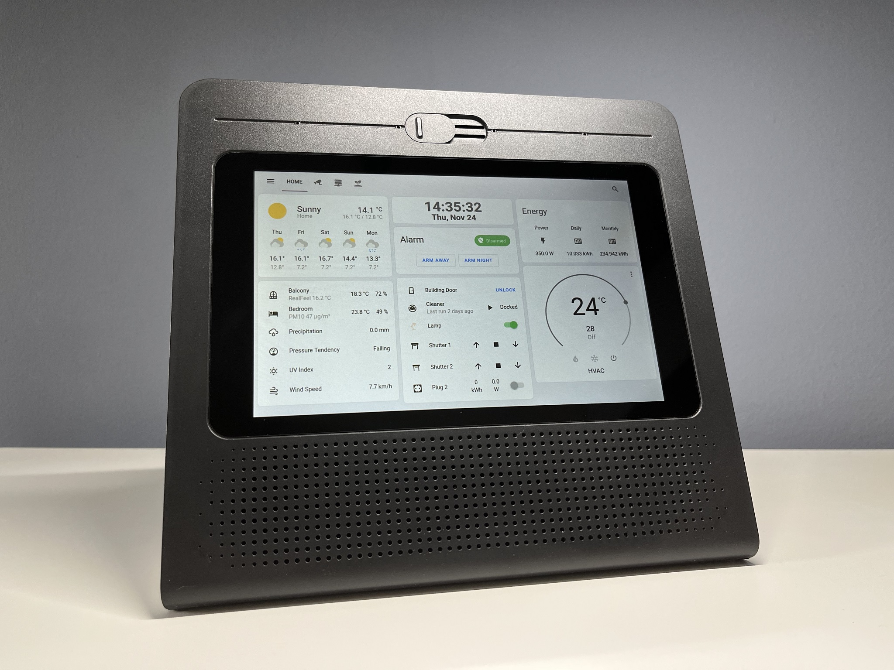

# Repurposing Movistar Home

as a Home Assistant dashboard panel.

  

[🇪🇸 Versión en castellano](./README.md)

Join our [Telegram group chat](https://t.me/movistar_home_hacking) for more information!

## Important note

Currently there are at least 2 different models of Movistar Home exist, check the sticker label on the bottom of your device to identify its model.

### RG3205W

Manufactured by _ASKEY_, likely after 2019.

It has a Qualcomm Snapdragon 625 (**arm64**) SoC.

If you have this model, please refer to [RG3205W/README.en.md](./RG3205W/README.en.md).

### IGW-5000A2BKMP-I v2

Manufactured by _MitraStar_, likely from 2018 to 2020.

It has an Intel Atom x5-Z8350 (**x86-64**) CPU.

If you have this model, please refer to [IGW5000/README.en.md](./IGW5000/README.en.md).

## Credits

Special thanks to everyone who has contributed!

- Cansi
- Carlos
- Howard
- Iscle [@iscle](https://github.com/iscle)
- José
- Pablo
- Nadia Santalla [@nadiamoe](https://github.com/nadiamoe)
- P4blo24
- josemoraocana
- Alfredo [@alfredopironti](https://github.com/alfredopironti)
- Chocomerde
- Lucas Sánchez
- Tony
- Javier

## Disclaimer

This project is an **unofficial, community-driven effort** and is **not affiliated with, endorsed by, or sponsored by Movistar, Telefónica, MitraStar, Askey, or any of their subsidiaries or partners**.

All trademarks, service marks, product names, and logos mentioned in this repository are the property of their respective owners. Their use here is **solely for identification and descriptive purposes**, to refer to the original device and services in a factual manner.

This project is provided **"as-is"** and is intended **for personal, educational, and research purposes only**.

* No part of this project should be interpreted as an attempt to **circumvent security protections** or to **infringe upon intellectual property rights**.
* Following the guides or instructions in this repository will certainly **void the warranty** of your device and may violate your service agreement or contract.
* You are **solely responsible** for ensuring that your use of this project complies with all applicable laws, terms of service, and agreements.
* The authors of this project assume **no liability** for any damages or legal issues that may result from its use.

If you represent Movistar, Telefónica, MitraStar, or Askey and have concerns about the content of this repository, please open an Issue [here](https://github.com/zry98/movistar-home-hacks/issues/new) or contact the repository owner ([@zry98](https://github.com/zry98])) directly, who will address it promptly.

## Aviso legal

Este proyecto es un **esfuerzo no oficial impulsado por la comunidad** y **no está afiliado, respaldado ni patrocinado por Movistar, Telefónica, MitraStar, Askey ni por ninguna de sus filiales o socios**.

Todas las marcas comerciales, marcas de servicio, nombres de productos y logotipos mencionados en este repositorio son propiedad de sus respectivos dueños. Su uso aquí es **únicamente con fines de identificación y descriptivos**, para referirse al dispositivo y a los servicios originales de manera objetiva.

Este proyecto se proporciona **"tal cual"** *("as-is")* y está destinado **exclusivamente a fines personales, educativos y de investigación**.

* Ninguna parte de este proyecto debe interpretarse como un intento de **eludir protecciones de seguridad** o de **infringir derechos de propiedad intelectual**.
* Seguir las guías o instrucciones de este repositorio **anulará la garantía** de tu dispositivo y puede violar tu contrato o acuerdo de servicio.
* Tú eres el **único responsable** de garantizar que tu uso de este proyecto cumpla con todas las leyes, términos de servicio y acuerdos aplicables.
* Los autores de este proyecto **no asumen ninguna responsabilidad** por daños o problemas legales que puedan derivarse de su uso.

Si representas a Movistar, Telefónica, MitraStar o Askey y tienes alguna preocupación sobre el contenido de este repositorio, abre un *Issue* [aquí](https://github.com/zry98/movistar-home-hacks/issues/new) o contacta directamente con el propietario del repositorio ([@zry98](https://github.com/zry98)), quien lo atenderá de manera inmediata.
