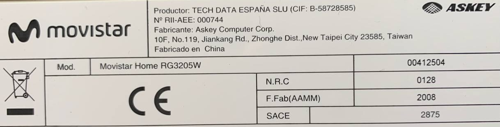
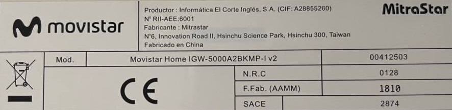

# Reutilización de Movistar Home

como un panel de dashboard para Home Assistant.

[🇺🇸 English version](README.en.md)

¡Únete a nuestro [grupo de Telegram](https://t.me/movistar_home_hacking) para más información!

## Nota importante

Actualmente existen al menos 2 modelos diferentes de Movistar Home, revisa la etiqueta adhesiva en la parte de abajo de tu dispositivo para identificar su modelo.

### RG3205W

Fabricado por _ASKEY_, probablemente después de 2018.

Tiene un SoC Qualcomm Snapdragon 625 (**arm64**).

Si tienes este modelo, por favor consulta [RG3205W/README.md](RG3205W/README.md).

Aunque si de forma algo limitada, puedes aprovechar el dispositivo sin necesidad de soldar cables o abrir su caja, siguiendo [este tutorial](RG3205W/rev5_howto.es.md).

### IGW-5000A2BKMP-I v2

Fabricado por _MitraStar_, probablemente antes de 2020.

Tiene una CPU Intel Atom x5-Z8350 (**x86-64**).

Si tienes este modelo, por favor consulta [IGW5000/README.md](IGW5000/README.md).

## Créditos

¡Muchas gracias a todos los que han contribuido!

- Cansi
- Carlos
- Howard
- Iscle [@iscle](https://github.com/iscle)
- José
- Pablo
- Nadia Santalla [@nadiamoe](https://github.com/nadiamoe)
- P4blo24
- josemoraocana
- Alfredo [@alfredopironti](https://github.com/alfredopironti)

## Aviso legal

Este proyecto es un **esfuerzo no oficial impulsado por la comunidad** y **no está afiliado, respaldado ni patrocinado por Movistar, Telefónica, MitraStar, Askey ni por ninguna de sus filiales o socios**.

Todas las marcas comerciales, marcas de servicio, nombres de productos y logotipos mencionados en este repositorio son propiedad de sus respectivos dueños. Su uso aquí es **únicamente con fines de identificación y descriptivos**, para referirse al dispositivo y a los servicios originales de manera objetiva.

Este software se proporciona **"tal cual"** *("as-is")* y está destinado **exclusivamente a fines personales, educativos y de investigación**.

* Ninguna parte de este proyecto debe interpretarse como un intento de **eludir protecciones de seguridad** o de **infringir derechos de propiedad intelectual**.
* Seguir las guías o instrucciones de este repositorio **anulará la garantía** de tu dispositivo y puede violar tu contrato o acuerdo de servicio.
* Tú eres el **único responsable** de garantizar que tu uso de este proyecto cumpla con todas las leyes, términos de servicio y acuerdos aplicables.
* Los autores de este proyecto **no asumen ninguna responsabilidad** por daños o problemas legales que puedan derivarse de su uso.

Si representas a Movistar, Telefónica, MitraStar o Askey y tienes alguna preocupación sobre el contenido de este repositorio, abre un *issue* o contacta directamente con el propietario del repositorio [@zry98](https://github.com/zry98), quien lo atenderá de manera inmediata.
