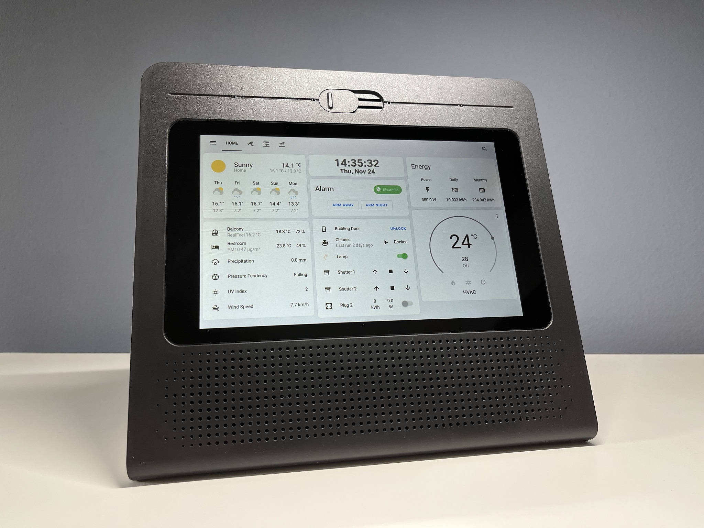
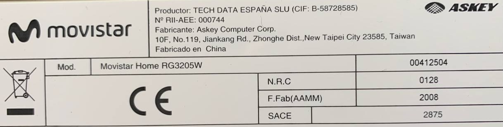
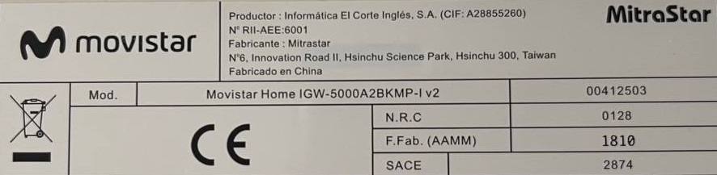

# Reutilización de Movistar Home

como un panel de dashboard para Home Assistant.

[🇺🇸 English version](./README.en.md)

¡Únete a nuestro [grupo de Telegram](https://t.me/movistar_home_hacking) para más información!

## Nota importante

Actualmente existen al menos 2 modelos diferentes de Movistar Home, revisa la etiqueta adhesiva en la parte de abajo de tu dispositivo para identificar su modelo.

### RG3205W

Fabricado por _ASKEY_, probablemente después de 2019.

Tiene un SoC Qualcomm Snapdragon 625 (**arm64**).

Si tienes este modelo, por favor consulta [RG3205W/README.md](./RG3205W/README.md).

### IGW-5000A2BKMP-I v2

Fabricado por _MitraStar_, probablemente desde 2018 hasta 2020.

Tiene una CPU Intel Atom x5-Z8350 (**x86-64**).

Si tienes este modelo, por favor consulta [IGW5000/README.md](./IGW5000/README.md).

## Créditos

¡Muchas gracias a todos los que han contribuido!

- Cansi
- Carlos
- Howard
- Iscle [@iscle](https://github.com/iscle)
- José
- Pablo
- Nadia Santalla [@nadiamoe](https://github.com/nadiamoe)
- P4blo24
- josemoraocana
- Alfredo [@alfredopironti](https://github.com/alfredopironti)

## Aviso legal

Este proyecto es un **esfuerzo no oficial impulsado por la comunidad** y **no está afiliado, respaldado ni patrocinado por Movistar, Telefónica, MitraStar, Askey ni por ninguna de sus filiales o socios**.

Todas las marcas comerciales, marcas de servicio, nombres de productos y logotipos mencionados en este repositorio son propiedad de sus respectivos dueños. Su uso aquí es **únicamente con fines de identificación y descriptivos**, para referirse al dispositivo y a los servicios originales de manera objetiva.

Este proyecto se proporciona **"tal cual"** *("as-is")* y está destinado **exclusivamente a fines personales, educativos y de investigación**.

* Ninguna parte de este proyecto debe interpretarse como un intento de **eludir protecciones de seguridad** o de **infringir derechos de propiedad intelectual**.
* Seguir las guías o instrucciones de este repositorio **anulará la garantía** de tu dispositivo y puede violar tu contrato o acuerdo de servicio.
* Tú eres el **único responsable** de garantizar que tu uso de este proyecto cumpla con todas las leyes, términos de servicio y acuerdos aplicables.
* Los autores de este proyecto **no asumen ninguna responsabilidad** por daños o problemas legales que puedan derivarse de su uso.

Si representas a Movistar, Telefónica, MitraStar o Askey y tienes alguna preocupación sobre el contenido de este repositorio, abre un *Issue* [aquí](https://github.com/zry98/movistar-home-hacks/issues/new) o contacta directamente con el propietario del repositorio ([@zry98](https://github.com/zry98)), quien lo atenderá de manera inmediata.

## Disclaimer

This project is an **unofficial, community-driven effort** and is **not affiliated with, endorsed by, or sponsored by Movistar, Telefónica, MitraStar, Askey, or any of their subsidiaries or partners**.

All trademarks, service marks, product names, and logos mentioned in this repository are the property of their respective owners. Their use here is **solely for identification and descriptive purposes**, to refer to the original device and services in a factual manner.

This project is provided **"as-is"** and is intended **for personal, educational, and research purposes only**.

* No part of this project should be interpreted as an attempt to **circumvent security protections** or to **infringe upon intellectual property rights**.
* Following the guides or instructions in this repository will certainly **void the warranty** of your device and may violate your service agreement or contract.
* You are **solely responsible** for ensuring that your use of this project complies with all applicable laws, terms of service, and agreements.
* The authors of this project assume **no liability** for any damages or legal issues that may result from its use.

If you represent Movistar, Telefónica, MitraStar, or Askey and have concerns about the content of this repository, please open an Issue [here](https://github.com/zry98/movistar-home-hacks/issues/new) or contact the repository owner ([@zry98](https://github.com/zry98]) directly, who will address it promptly.
