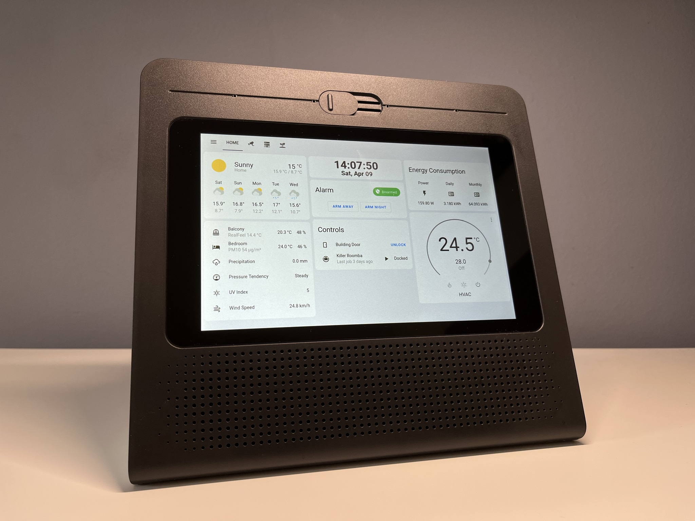
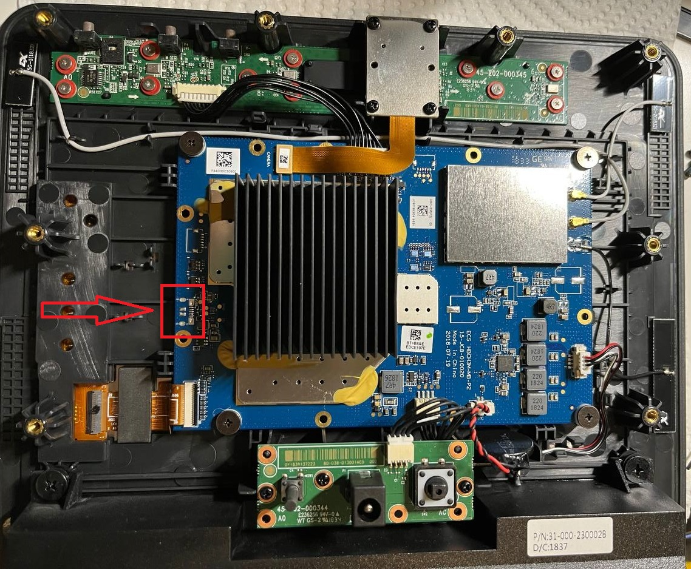

# Reutilización de Movistar Home

como un panel de dashboard para Home Assistant.

[English version](README.en.md)

[Research notes](researches.md)



## SE NECESITA AYUDA

He descargado el firmware original de Android-x86 en la memoria flash, pero no se pudo iniciar después de que lo volví a escribir, además la partición /data estaba cifrada y no pude encontrar una manera de descifrarla.

Las contribuciones al [repositorio](https://github.com/zry98/movistar-home-hacks) son muy bienvenidas si tienes algunos descubrimientos; o si tienes una Movistar Home que no estás usando y quieres ayudar en este proyecto, por favor contáctame a través de mi email en [mi perfil de GitHub](https://github.com/zry98), ¡muchas gracias!

### Lista de tareas

- [ ] Arreglar el driver de la tarjeta de sonido (configuraciones de [ALSA](https://en.wikipedia.org/wiki/Advanced_Linux_Sound_Architecture))
- [ ] Arreglar el driver de la cámara
- [ ] Arreglar el driver de bluetooth
- [ ] Arreglar el botón de reinicio
- [ ] Encontrar una manera de instalar Linux sin desmontar ni soldar (quizás a través del [easycwmp en el puerto 7547](researches.md#easycwmp))

## Especificaciones

| | |
| --- | --- |
| CPU | Intel Atom x5-Z8350 (4C4T) @ 1.44 GHz |
| RAM | Hynix 2 GB DDR3 ECC @ 1600 MHz |
| Almacenamiento | Kingston TB2816 16 GB eMMC |
| Pantalla | 8 pulgadas 1280x800 con pantalla táctil de I2C de Goodix |
| Wi-Fi & Bluetooth | Realtek RTL8822BE |
| Tarjeta de sonido | Realtek RT5672 |
| Altavoces | 2 x 5 W (SPL 87 dB @ 1 W \| 1 m) |
| Micrófonos | 4 micrófonos omnidireccionales con DSP dedicado |
| Cámara | OMNIVISION OV2680 con 2 megapíxeles |
| Medidas | 21,2 x 23,5 x 12,2 cm (alto x ancho x fondo) |
| Peso | 1,1 kg |

## Estado de los drivers

Como en el último Manjaro XFCE con kernel 5.15.71-1, el 5 de noviembre de 2022:

| Dispositivo | Driver | Estado |
| --- | --- | --- |
| Pantalla táctil | goodix | OK |
| Wi-Fi | rtw88_8822be | OK |
| Bluetooth | rtw88_8822be | No funciona |
| Tarjeta de sonido | snd_soc_sst_cht_bsw_rt5672 | No funciona |
| Cámara | atomisp | No funciona |

## Instalación de Linux

Desmonta el dispositivo, hay 10 presillas (snap-fits) debajo de los bordes del panel posterior, ten cuidado de no dañarlos; luego hay 8 tornillos debajo de él.

Localiza el puerto vacío de micro USB en el borde izquierdo de la placa base, para el modelo `IGW-5000A2BKMP-I v2`:



Para la placa rev5 en el modelo más nuevo `RG3205W` (aun no he probado uno):


Suelda un conector hembra micro USB y conecta un cable adaptador OTG, o simplemente un cable con un conector hembra USB estándar, luego cortocircuita el cuarto pin (o la pad `ID`) a la tierra (GND), haciendo que el dispositivo funcione como un OTG host.

Suelda un conector hembra de micro USB y conecta un cable adaptador OTG; o simplemente suelda un cable con un conector hembra de USB-A estándar, luego cortocircuita el cuarto pin (o el pad `ID`) a tierra (GND, el quinto pin), haciendo que el dispositivo funcione como un OTG host.

Flashea un pendrive USB con tu distribución de Linux favorita, recomiendo usar el entorno de escritorio Xfce ya que el Movistar Home solo tiene 2 GB de RAM.

Conecta un teclado y el pendrive a un hub de USB y conéctalo al Movistar Home. Enciéndelo mientras presiona la tecla `F2`, se iniciará a la configuración del BIOS, navega a la última pestaña (`Save & Exit`), selecciona tu pendrive (debería ser algo así como `UEFI: USB, Partition 1`) en el menú `Boot Override`, presiona la tecla Enter para iniciarlo.


Instala tu linux como de costumbre, puede ser necesario incluir los *non-free* drivers.

Se recomienda configurar el servidor OpenSSH antes de desoldar el conector USB y volver a montar el dispositivo, para los posibles mantenimientos en el futuro.

## Configuraciones

Las siguientes configuraciones se realizaron para Manjaro XFCE y es posible que necesiten algunas modificaciones para las otras distribuciones.

### Corregir la rotación de la pantalla

Crea el archivo `/etc/X11/xorg.conf.d/20-monitor.conf` con el siguiente contenido:

```
Section "Monitor"
        Identifier      "DSI1"
        Option          "Rotate" "right"
        Option          "Scale"  "0.8x0.8"
EndSection
```

Ajusta el parámetro de escala (*Scale*) a tu gusto, descubrí que 0.8x es el más adecuado para esta pantalla.

### Arreglar la pantalla táctil

Por alguna razón, la pantalla táctil no funciona en absoluto a menos que se reinicie por una vez, en *dmesg* el driver dice "*Goodix-TS i2c-GDIX1001:00: Invalid config (0, 0, 0), using defaults*".

Crea el archivo `/etc/systemd/system/fix-touchscreen.service` con el siguiente contenido:

```systemd
[Unit]
Description=Arreglar la pantalla táctil

[Service]
Type=oneshot
ExecStart=sh -c 'dmesg | grep -q " Goodix-TS .*: Invalid config " && reboot now || exit 0'

[Install]
WantedBy=multi-user.target
```

Ejecuta `sudo systemctl daemon-reload && systemctl enable fix-touchscreen.service` para que se ejecute al iniciar.

Para corregir la rotación, crea el archivo `/etc/X11/xorg.conf.d/30-touchscreen.conf` con el siguiente contenido:

```
Section "InputClass"
        Identifier      "calibration"
        MatchProduct    "Goodix Capacitive TouchScreen"
        Option          "TransformationMatrix"  "0 1 0 -1 0 1 0 0 1"
EndSection
```

#### Arreglar el control tactil en Firefox

*Fuente: [Firefox/Tweaks - ArchWiki](https://wiki.archlinux.org/title/Firefox/Tweaks#Enable_touchscreen_gestures)*

Abre la Firefox y acceda a `about:config`, busca por `dom.w3c_touch_events.enabled` y asegúrase de que está configurado a 1 (*habilitado*) o 2 (*predeterminado, detección automática*).

Añade `MOZ_USE_XINPUT2 DEFAULT=1` a `/etc/security/pam_env.conf`.

### Reducción automática de brillo

Crea el archivo `/etc/X11/xorg.conf.d/10-intel.conf` con el siguiente contenido:

```
Section "Device"
        Identifier      "Intel Graphics"
        Driver          "intel"
        Option          "AccelMethod"   "sna"
        Option          "TearFree"      "true"
        Option          "Backlight"     "intel_backlight"
EndSection
```

Abre el `Administrador de energía` de Xfce, cambia a la pestaña `Pantalla` y ajusta la configuración de `Reducción de brillo`. Personalmente lo configuré para que se reduzca al 20% después de 90 segundos de inactividad.

También recuerda a deshabilitar la suspensión/apagar automático desde allí.

Crea el archivo `~/.config/autostart/set-backlight.desktop` con el siguiente contenido:

```systemd
[Desktop Entry]
Encoding=UTF-8
Version=0.9.4
Type=Application
Name=Pantalla Brillo
Comment=Establecer el brillo de la retroiluminación al inicial
Exec=bash -c "echo 100 > /sys/class/backlight/intel_backlight/brightness"
OnlyShowIn=XFCE;
RunHook=0
StartupNotify=false
Terminal=false
Hidden=false
```

(Descubrí que esto no se puede hacer a través de un servicio de systemd)

### Teclado virtual

Instala [*Onboard*](https://archlinux.org/packages/community/x86_64/onboard/) con `sudo pacman -S onboard`, abre la configuración `Sesión e inicio` de Xfce, cambia a la pestaña `Autoarranque de aplicaciones`, busca y habilita `Onboard (Teclado en pantalla flexible)`.

Después de reiniciar, abre la configuración de Onboard y ajústala a tu gusto.

### Ocultar cursor del ratón

Instala [*unclutter*](https://archlinux.org/packages/community/x86_64/unclutter/) con `sudo pacman -S unclutter`.

Crea el archivo `~/.config/autostart/hide-cursor.desktop` con el siguiente contenido:

```systemd
[Desktop Entry]
Encoding=UTF-8
Version=0.9.4
Type=Application
Name=Ocultar cursor
Comment=Ocultar cursor del ratón
Exec=unclutter --hide-on-touch
OnlyShowIn=XFCE;
RunHook=0
StartupNotify=false
Terminal=false
Hidden=false
```

### Home Assistant dashboard

Crea el archivo `~/.config/autostart/HASS.desktop` con el siguiente contenido:

```systemd
[Desktop Entry]
Encoding=UTF-8
Version=0.9.4
Type=Application
Name=HASS Dashboard
Comment=Ejecute el dashboard de HASS en el mode quiosco de Firefox
Exec=firefox -kiosk -url 'https://tu.hass.url'
OnlyShowIn=XFCE;
RunHook=0
StartupNotify=false
Terminal=false
Hidden=false
```

Ejecutará Firefox en modo quiosco al iniciar, del que solo puedes salir presionando alt+F4 o usando el comando kill en SSH.

### Evitar que la pantalla se queme

Dado que se usará principalmente para mostrar un dashboard de HASS todos los días, es muy probable que [la pantalla se queme](https://en.wikipedia.org/wiki/Screen_burn-in) después de un tiempo, aunque tiene una pantalla LCD.

Para evitar eso, escribí un script de Python para que muestre periódicamente varios colores en pantalla completa para actualizar todos los píxeles.

**¡NO USA este script si tú o un miembro de tu familia tiene [epilepsia fotosensible](https://es.wikipedia.org/wiki/Epilepsia_fotosensible)!**

Crea el archivo `/usr/bin/screensaver.py` con el siguiente contenido:

```python
#!/usr/bin/env python3
from time import time
import tkinter as tk

color_interval = 300  # milisegundos
total_time = 10  # segundos, saldrá después

colors = ['red', 'green', 'blue', 'black', 'white']
color_index = 0

root = tk.Tk()
w, h = root.winfo_screenwidth(), root.winfo_screenheight()
root.overrideredirect(True)
root.attributes('-fullscreen', True)
canvas = tk.Canvas(root, width=w, height=h, background='black', highlightthickness=0)
canvas.pack()
canvas.focus_set()
canvas.bind('<Button-1>', lambda _: root.destroy())  # saldrá al tocar


def flash_color():
    global color_index
    if time() - time_start > total_time: root.destroy()
    canvas.configure(background=colors[color_index])
    color_index = (color_index + 1) % len(colors)
    root.after(color_interval, flash_color)


time_start = time()
flash_color()
root.mainloop()
```

Ajusta las dos variables `color_interval` y `total_time` a tu gusto, con `total_time = 10` se ejecutará durante 10 segundos, toca la pantalla si necesitas detenerlo de inmediato.

Ejecuta el comando `chmod +x /usr/bin/screensaver.py` para hacerlo ejecutable, luego ejecuta el comando `crontab -e` y agrega un trabajo de cron como sigue, que ejecutará el script cada hora:

```crontab
0 * * * *       export DISPLAY=:0; /usr/bin/screensaver.py
```
