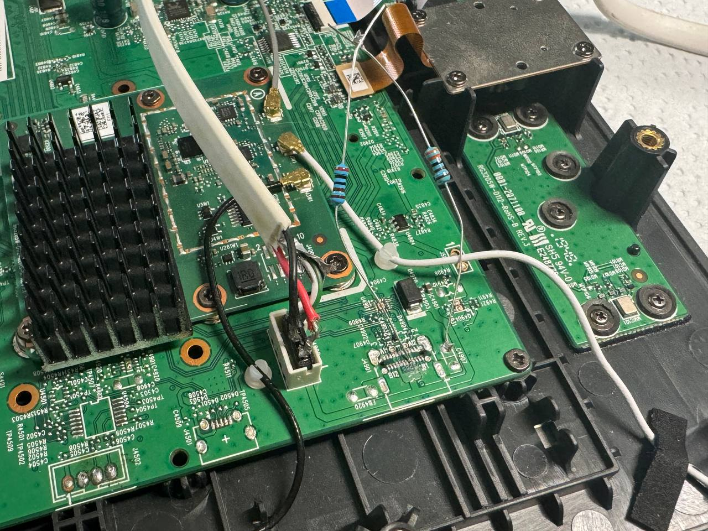
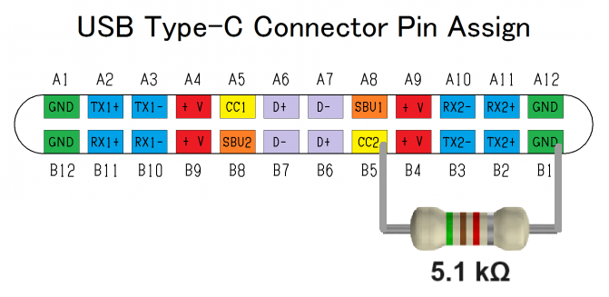
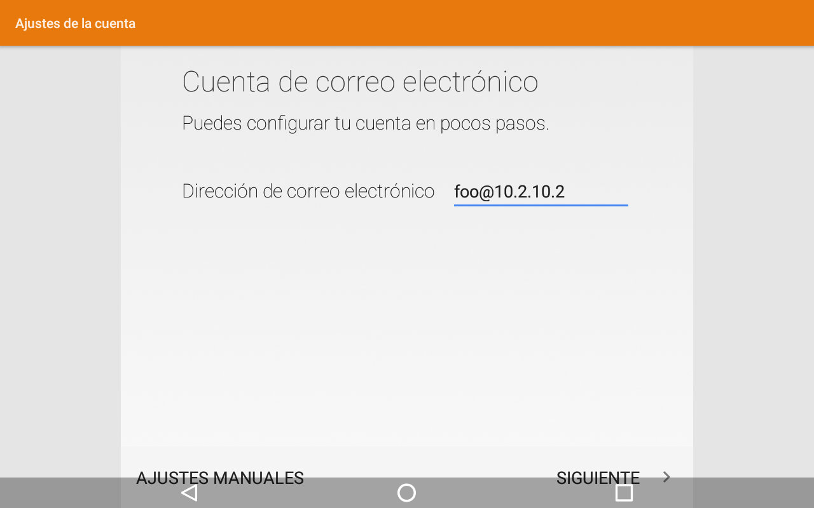
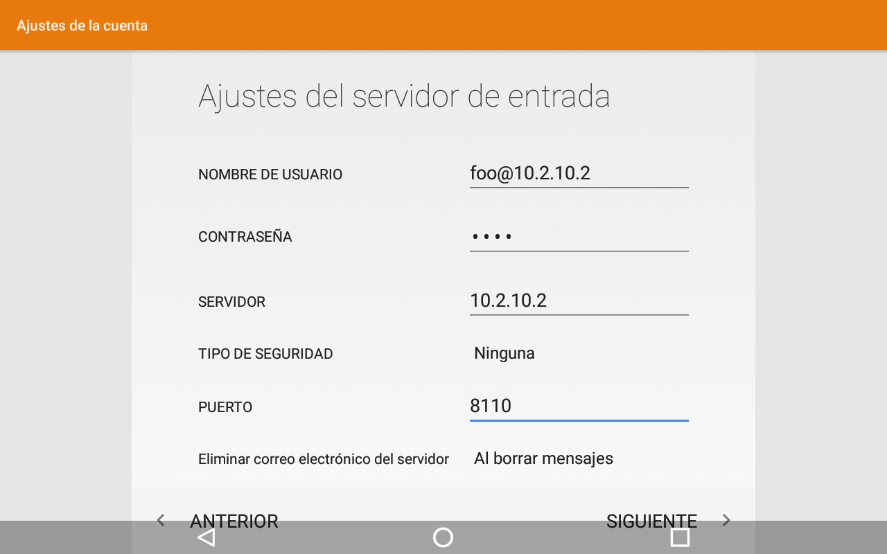
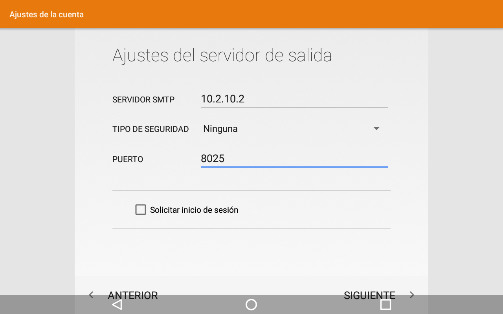
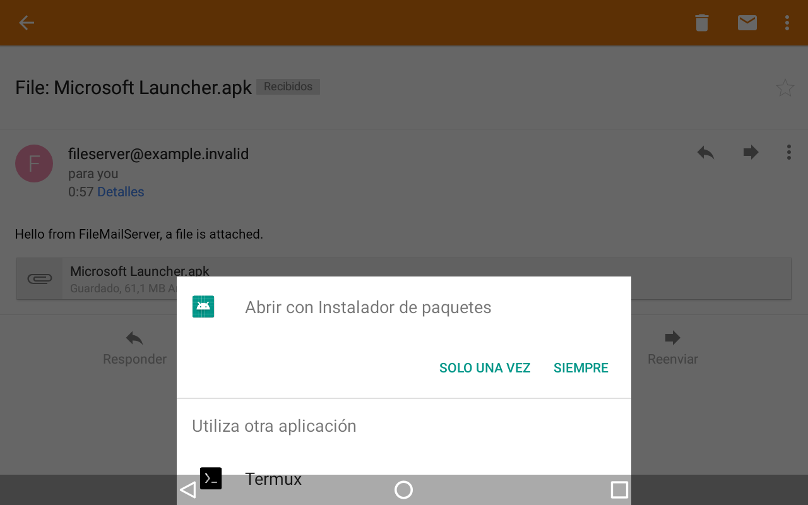

# Repurposing Movistar Home - RG3205W

as a Home Assistant dashboard panel.

**This document is only intended for the model `RG3205W` with a Qualcomm arm64 SoC. For the model `IGW-5000A2BKMP-I v2` with an Intel x86 CPU, please refer to [IGW5000/README.en.md](../IGW5000/README.en.md).  [_How to identify?_](../README.en.md#important-note)**

[🇪🇸 Versión en castellano](./README.md)

> [!IMPORTANT]
> **WORK IN PROGRESS**, especially for the Rev5 variant.

## Tech specs

| | |
| --- | --- |
| SoC | Qualcomm Snapdragon 625 (8C8T, Cortex-A53) @ 1.80 GHz |
| OS | Android 8.1.0, kernel 3.18.71-perf, armv7l (32-bit) instead of aarch64 |
| RAM | 3 GB |
| Storage | 32 GB |
| Screen | 8-inch 1280x800 with Goodix I2C touch screen |
| Wi-Fi & Bluetooth | Qualcomm QCA9379 |
| Speakers | 2 x 5 W (SPL 87 dB @ 1 W \| 1 m) |
| Microphones | 4 omnidirectional microphones with dedicated DSP |
| Camera | OMNIVISION OV2735 with 2 megapixels |
| Dimensions | 21.2 x 23.5 x 12.2 cm (height x width x depth) |
| Weight | 1.1 kg |

## Kiosk escaping

> [!CAUTION]
> Following the instructions below will certainly **void the warranty** of your device and **may violate your service agreement or contract** with Movistar. Proceed entirely at your own risk.

You don't need (and very difficult) to install Linux like with the model `IGW-5000A2BKMP-I v2`.

If your have a Movistar Wi-Fi with valid _Fusión_ contract, you can enter the main screen after connecting to it. Pull down the top panel and tap "Ajustes" to open the settings, then tap _Conectividad > Altavoz bluetooth_ to enter the menu originally meant for connecting to a Bluetooth speaker. But for some reason, it can also be used to connect a Bluetooth keyboard; if you don't have one, you can try using a virtual Bluetooth keyboard app on your Android phone. You can now skip the next section and go directly to the [configurations part](#configurations).

But if you don't have a Movistar Wi-Fi, you cannot skip the Wi-Fi connection screen and access the Bluetooth settings. You'll have to dissemble it and do some soldering. For dissembling, you can refer to [the section in IGW5000/README.en.md](../IGW5000/README.en.md#disassembling) as the chassis are identical.

### Connecting a USB keyboard

Currently there are at least 2 variants (hardware revisions) of RG3205W exist: `Rev4` and `Rev5`.

> [!IMPORTANT]
> To identify these 2 variants, **the only reliable way** is to take off the back panel, to see the markings on the PCB, or the existence of USB Type-C connector.
>
> There have been several exceptions reported on the manufacture date on the adhesive label, for example, `2001` can be Rev4 or Rev5.

#### Rev4

If yours has a `Rev4` PCB, then you are very lucky that it comes with a female USB Type-C connector already soldered and functioning!

#### Rev5

But unfortunately, the more common variant on the market is `Rev5`, which not only comes without the USB Type-C connector populated, but also lacks a 5.1 kΩ pull-down resistor between the `CC` (`CC1` or `CC2` depending on the side) and `GND` pins to put it in host mode. So you'll have to solder the resistor yourself like below:

The 4-pin white female JST-PH2.0 connector nearby is also connected to the 4 USB 2.0 pins, with the pinout from left to right: `D-`, `D+`, `GND`, `+5V`, you can use it to lead out the USB connection without needing to solder an SMD USB Type-C connector (which is very difficult to do).

## Configurations

Anyway, with a USB or Bluetooth keyboard connected, you can press the keys <kbd>Super</kbd> + <kbd>N</kbd> (<kbd>Super</kbd> is usually the <kbd>⊞ Win</kbd> key) to open the notification panel, then tap the gear icon to open the Android system settings.

If you got a Rev4 variant, you are so lucky that it doesn't have any restrictions in the ROM, so you can just enable the Developer options by tapping the build number 7 times, then enable USB debugging and do any kind of stuff via ADB.

Unfortunately, for the Rev5 variant we still haven't found a way to enable USB debugging (ADB), because the whole "Developer options" menu is removed completely from the ROM, along with many many other things.

However, you can still install APKs by using the built-in E-mail app. You can open that app by pressing the keys <kbd>Super</kbd> + <kbd>E</kbd>, then configure an email account. After that, you can send an email to this address with the APK attached, then open the email in the app and tap the attachment to download and install it.

> [!TIP]
> You should not use major email providers like Gmail either for sending or receiving, because they normally do not allow APK attachments. You can use the "[email-file-server](https://github.com/zry98/movistar-home-hacks/tree/main/email-file-server)" tool provided in this repository, please check the [next subsection](#use-the-email-file-server-tool) for detailed instructions.

**For more information on soft-hacks for the Rev5, please refer to [rev5-softhacks/README.en.md](./rev5-softhacks/README.en.md).**

First app you should definitely install is a [launcher](https://search.f-droid.org/?q=launcher), and set it as the default launcher (_Settings > Apps & notifications > Advanced > Default apps > Home app_), otherwise you'll still be stuck in the onboarding app every time it reboots.

But be aware that the onboarding app will still show up and lock you out when the Wi-Fi connection changes. So we still need to find a way to uninstall them.

#### Use the email-file-server tool

You should have a PC that is accessible from your Movistar Home, for example, in the same LAN.

Download the email-file-server release suitable for your PC from its [release page](https://github.com/zry98/movistar-home-hacks/releases/tag/v0.0.1), for example, `email-file-server_v0.0.1_windows_amd64.zip` for most Windows PC. Decompress the archive and put the APK files you want to install on Movistar Home inside the `files` folder in the decompressed folder.

Open a terminal in the same folder, execute `./email-file-server`. By default, it will read all files inside the `files` folder, and start a minimal POP3 server listening on the 8110 port, and a minimal SMTP server listening on the 8025 port.

You can run `./email-file-server --help` to see its usage if you want to customize anything.

In the mail app on your Movistar Home, configure an account with any address, then click the button "AJUSTES MANUALES":

Select the "PERSONAL (POP3)" type of account.

Input any password, then click the button "SIGUIENTE".

Input the IP address of your PC running the server in the "SERVIDOR" field, select "Ninguna" as the "TIPO DE SEGURIDAD", and input the POP3 port (`8110` by default) in the "PUERTO" field. Then click "SIGUIENTE":

Input the same IP address in the "SERVIDOR SMTP" field, select "Ninguna" as the "TIPO DE SEGURIDAD", input the SMTP port (`8025` by default) in the "PUERTO" field, and uncheck the box "Solicitar inicio de sesión". Then click "SIGUIENTE":

Select "Nunca" as the "Frecuencia de sincronización", and click "SIGUIENTE".

You can give a name to the account but it's not necessary, just click "SIGUIENTE" and you should see the inbox. By default, it will start fetching all the mails (with APK attached, which can be huge), please wait for the loading spinner to finish. If you don't see anything, swipe down to force sync.

After you see the mail containing the APK you want, open it and click the attachment, then click any of the two buttons to install it:

## Resources

- [Rev4 stock ROM partial dump](./stock-rom-dumps/ES_g1.0_RG3205W1.2.4_201912112049) using ADB, made by _Cansi_ in our Telegram group
- [Rev5 stock ROM dump](./stock-rom-dumps/ES_g1.0_RG3205W3.7.0_202209282206) using EDL mode, made by _P4blo24_ in our Telegram group
- [Virtual Bluetooth Keyboard & Mouse](https://play.google.com/store/apps/details?id=io.appground.blek) for Android, suggested by _josemoraocana_ in our Telegram group
