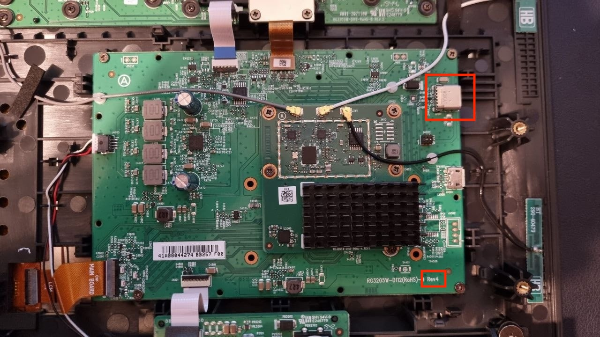
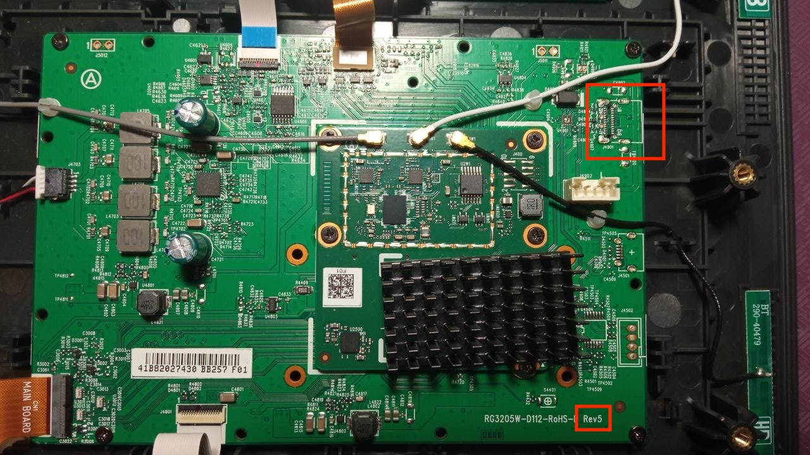
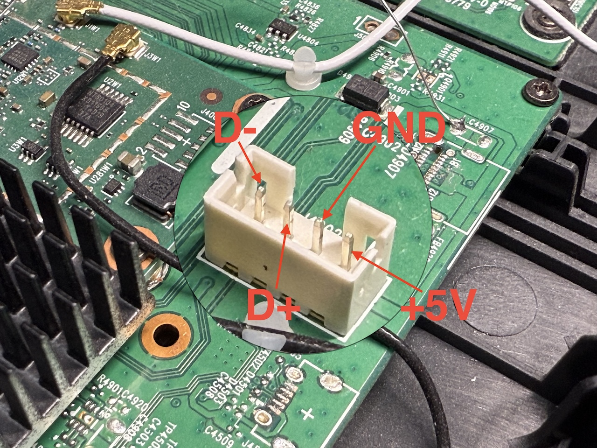

# Repurposing Movistar Home - RG3205W

as a Home Assistant dashboard panel.

**This document is only intended for the model `RG3205W` with a Qualcomm arm64 SoC. For the model `IGW-5000A2BKMP-I v2` with an Intel x86 CPU, please refer to [IGW5000/README.en.md](../IGW5000/README.en.md).  [_How to identify?_](../README.en.md#important-note)**

[🇪🇸 Versión en castellano](./README.md)

## Tech specs

| | |
| --- | --- |
| SoC | Qualcomm Snapdragon 625 (8C8T, Cortex-A53) @ 1.80 GHz |
| OS | Android 8.1.0, kernel 3.18.71-perf, armv7l (32-bit) instead of aarch64 |
| RAM | 3 GB |
| Storage | 32 GB |
| Screen | 8-inch 1280x800 with Goodix I2C touch screen |
| Wi-Fi & Bluetooth | Qualcomm QCA9379 |
| Speakers | 2 x 5 W (SPL 87 dB @ 1 W \| 1 m) |
| Microphones | 4 omnidirectional microphones with dedicated DSP |
| Camera | OMNIVISION OV2735 with 2 megapixels |
| Dimensions | 21.2 x 23.5 x 12.2 cm (height x width x depth) |
| Weight | 1.1 kg |

## Disassembling

> [!CAUTION]
> Following the instructions below will certainly **void the warranty** of your device and **may violate your service agreement or contract** with Movistar. Proceed entirely at your own risk.

(It has a chassis identical to that of [IGW5000](../IGW5000/README.en.md#disassembling))

To disassemble the device, un-clip **10 snap-fits** under the back panel edges, be careful not to damage them.

Then remove **8 screws** under the panel, and **4 screws** hidden under the black rubber strip at the bottom of the device.

## Soft-hacks

For limited software-only hacks please refer to [rev5-softhacks/README.en.md](./rev5-softhacks/README.en.md).

## Flashing a modified ROM

> [!IMPORTANT]
> **WORK IN PROGRESS**

Fortunately, the bootloader can be unlocked and boot any modified ROM. In order to do this, you may need to improvise a modified USB cable depending on the variant you have.

Currently there are at least 2 variants (hardware revisions) of RG3205W exist: `Rev4` and `Rev5`.

> [!IMPORTANT]
> To identify these 2 variants, **the only reliable way** is to take off the back panel, to see the markings on the PCB, or the existence of USB Type-C connector.
>
> There have been several exceptions reported regarding the manufacture date "F.Fab(AAMM)" on the adhesive label, for example, `2001` can be Rev4 or Rev5.

#### Rev4

If yours has a `Rev4` PCB, then you are very lucky that it comes with a female USB Type-C connector already soldered and functioning! You can just connect a normal cable between it and your PC.

#### Rev5

But unfortunately, the more common variant on the market is `Rev5`, which comes without the USB Type-C connector populated.

However, the 4-pin white female JST-PH2.0 connector nearby is also connected to the 4 USB 2.0 pins, with the pinout from left to right: `D-`, `D+`, `GND`, `+5V`, you can use it to lead out the USB connection without needing to solder an SMD USB Type-C connector (which is very difficult to do).

You can improvise a simple custom cable using a JST-PH2.0 male plug, or a 4-pin female [pin header](https://en.wikipedia.org/wiki/Pin_header) of 2.0 mm pitch.

### Entering EDL mode

> [!IMPORTANT]
> It is recommended to use the [Qualcomm EDL mode](https://en.wikipedia.org/wiki/Qualcomm_EDL_mode) to make a full flash dump first, so that you can always restore it back to stock if anything goes wrong.

You can make the device enter EDL mode by shorting the USB `D+` and `GND` pins (for example, using metal knife or tweezers) while plugging in the power cable, and holding for 3 seconds before releasing.

Then you can use [Qualcomm's QPST tool](https://qpsttool.com/) on Windows, or better yet, B.Kerler's [edl](https://github.com/bkerler/edl) tool (cross-platform) to dump and flash the ROM.

An Firehose Programmer file (external bootloader) is required, a working one is provided in this repository at [`RG3205W/firehose.mbn`](firehose.mbn) (SHA256:0e03a8189b7451d1bb81d6fb10efbcefd399623edcb015af45008eedf8fd1298).

There are also several stock ROM dumps made by the community available in the [Resources](#resources) section below.

> [!CAUTION]
> Proceed with extra caution when flashing modified ROMs, as it may brick your device.
> 
> You should only touch the `boot`, `recovery`, `system`, `vendor` partitions, and clear `userdata` and `cache` after flashing.
>
> **DO NOT EVER** touch the other partitions, especially `persist`, `oem`, `modemst*`, etc,. As they can contain device-specific data like MAC addresses, IMEI, calibration data, etc.

### Entering recovery mode

In order to enter the recovery mode, power off the device first.

Hold the volume "+" (up), volume "-" (down) at the top and power buttons (the white button next to the power jack) all together, until the blue screen with white Movistar logo appears and disappears to a black screen (with a little bit backlight), release all the buttons.

Then, hold the volume "+" and power buttons together again, release them after 3 seconds. The recovery menu should appear.

> [!TIP]
> If the above method is not working for you, try disassembling the device and pressing the buttons directly without the plastic parts of the chassis, in case _you have morcilla fingers_.

You can navigate in this menu using the volume buttons, and select an option using the power button.

### Unlocking bootloader

Install the [Android SDK Platform Tools](https://developer.android.com/tools/releases/platform-tools) on your PC to get `adb` and `fastboot` commands.

Connect the device to your PC via USB, boot the device into recovery mode following the previous section, then select "Reboot to bootloader" option.

Running `fastboot devices` should show your device is identified.

Run `fastboot flashing unlock` and then `fastboot oem unlock` to unlock the bootloader.

### Flashing partitions

You can now flash modified images to the partitions using `fastboot flash <partition> <image-file>` command. For example, `fastboot flash system system.bin`.

This repository provides a modified ROM based on stock ROM [`ES_g1.0_RG3205W3.7.0_202209282206`](https://github.com/zry98/movistar-home-hacks/tree/main/RG3205W/stock-rom-dumps/ES_g1.0_RG3205W3.7.0_202209282206), with all the pre-installed bloatwares removed, added some useful apps, and some optimizations for better performance and prolonged eMMC lifespan. You can find it on the [Latest Release](https://github.com/zry98/movistar-home-hacks/releases/latest) page.

After flashing, reboot the device into the recovery mode again, select the "Wipe data/factory reset" option to format the `userdata` partition; then select "Wipe cache partition" option to format the `cache` partition.

Finally, select the "Reboot system now" option to reboot the device into the modified ROM.

## Resources

- [Rev4 stock ROM partial dump](https://github.com/zry98/movistar-home-hacks/tree/main/RG3205W/stock-rom-dumps/ES_g1.0_RG3205W1.2.4_201912112049) using ADB, made by _Cansi_ in our Telegram group
- [Rev5 stock ROM dump](https://github.com/zry98/movistar-home-hacks/tree/main/RG3205W/stock-rom-dumps/ES_g1.0_RG3205W3.7.0_202209282206) using EDL mode, made by _P4blo24_ in our Telegram group
