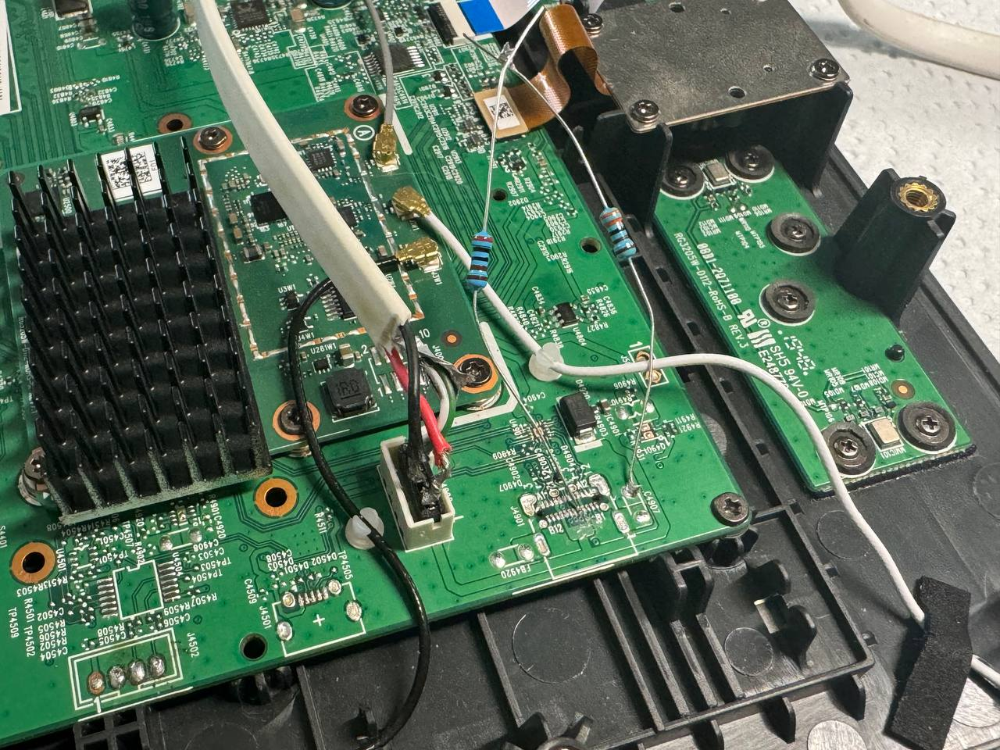
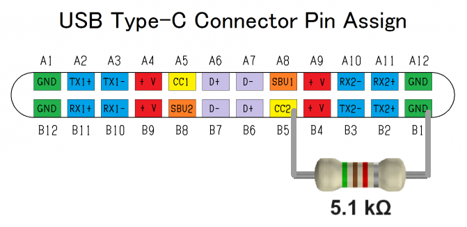

# Repurposing Movistar Home - RG3205W

as a Home Assistant dashboard panel.

**This document is only intended for the model `RG3205W` with a Qualcomm arm64 SoC. For the model `IGW-5000A2BKMP-I v2` with an Intel x86 CPU, please refer to [IGW5000/README.en.md](../IGW5000/README.en.md).  [_How to identify?_](../README.en.md#important-note)**

[🇪🇸 Versión en castellano](../RG3205W/README.md)

> [!IMPORTANT]
> **WORK IN PROGRESS**, especially for the Rev5 variant.

## Tech specs

| | |
| --- | --- |
| SoC | Qualcomm Snapdragon 625 (8C8T, Cortex-A53) @ 1.80 GHz |
| OS | Android 8.1.0, kernel 3.18.71-perf, armv7l (32-bit) instead of aarch64 |
| RAM | 3 GB |
| Storage | 32 GB |
| Screen | 8-inch 1280x800 with Goodix I2C touch screen |
| Wi-Fi & Bluetooth | Qualcomm QCA9379 |
| Speakers | 2 x 5 W (SPL 87 dB @ 1 W \| 1 m) |
| Microphones | 4 omnidirectional microphones with dedicated DSP |
| Camera | OMNIVISION OV2735 with 2 megapixels |
| Dimensions | 21.2 x 23.5 x 12.2 cm (height x width x depth) |
| Weight | 1.1 kg |

## Kiosk escaping

You don't need (and likely very difficult) to install Linux like with the model `IGW-5000A2BKMP-I v2`.

If your have a Movistar Wi-Fi with valid _Fusión_ contract, you can enter the main screen after connecting to it. Pull down the top panel and tap "Ajustes" to open the settings, then tap _Conectividad > Altavoz bluetooth_ to enter the menu originally meant for connecting to a Bluetooth speaker. But for some reason, it can also be used to connect a Bluetooth keyboard; if you don't have one, you can try using a virtual Bluetooth keyboard app on your Android phone. You can now skip the next section and go directly to the [configurations part](#configurations).

But if you don't have a Movistar Wi-Fi, you cannot skip the Wi-Fi connection screen and access the Bluetooth settings. You'll have to dissemble it and do some soldering. For dissembling, you can refer to [the section in IGW5000/README.en.md](../IGW5000/README.en.md#disassembling) as the chassis are identical.

### Connecting a USB keyboard

If yours has a `Rev4` (a known manufacturing date (YYMM): `2001`) PCB then you are very lucky that it comes with a female USB Type-C connector already soldered and functioning!

But unfortunately, the more common one on the market is `Rev5` (a known manufacturing date (YYMM): `2008`) which not only comes with the USB Type-C connector unpopulated, but also lacks a 5.1 kΩ pull-down resistor between the `CC` (`CC1` or `CC2` depending on the side) and `GND` pins to put it in host mode. So you'll have to solder the resistor yourself like below:

The 4-pin white female JST-PH connector nearby is also connected to the USB 2.0 pins, with the pinout from left to right: `D-`, `D+`, `GND`, `+5V`, you can use it to lead out the USB connection without needing to solder a USB Type-C SMD connector (which is very difficult to do).

## Configurations

Anyway, with a USB or Bluetooth keyboard connected, you can press the keys <kbd>Super</kbd> + <kbd>N</kbd> (<kbd>Super</kbd> is usually the <kbd>⊞ Win</kbd> key) to open the notification panel, then tap the gear icon to open the Android system settings.

### Rev4

If you got a Rev4 variant, you are so lucky that it doesn't have any restrictions in the ROM, so you can just enable the Developer options by tapping the build number 7 times, then enable USB debugging and do stuff via ADB.

### Rev5

Unfortunately, we still haven't found a way to enable USB debugging on the Rev5 variant, because the whole "Developer options" menu is removed from the ROM, along with many many other things.

However, you can still install APKs by using the built-in E-mail app. You can open that app by pressing the keys <kbd>Super</kbd> + <kbd>E</kbd>, then configure an email account. After that, you can send an email to this address with the APK attached, then open the email in the app and tap the attachment to download and install it.

**For more information on hacks for the Rev5, please refer to [RG3205W/rev5_howto.en.md](../RG3205W/rev5_howto.en.md).**

> [!TIP]
> You should not use Gmail either for sending or receiving, because APK attachments are not allowed.

First app you should definitely install is a [launcher](https://search.f-droid.org/?q=launcher), and set it as the default launcher (_Settings > Apps & notifications > Advanced > Default apps > Home app_), otherwise you'll still be stuck in the onboarding app every time it reboots.

But be aware that the onboarding app sometimes will disconnect the Wi-Fi and locks you out. So we still need to find a way to uninstall them.

## Resources

- [Rev5 ROM dump](https://t.me/movistar_home_hacking/1426) using EDL mode, made by _P4blo24_ in our Telegram group
- [Virtual Bluetooth Keyboard & Mouse](https://play.google.com/store/apps/details?id=io.appground.blek) for Android, suggested by _josemoraocana_ in our Telegram group
