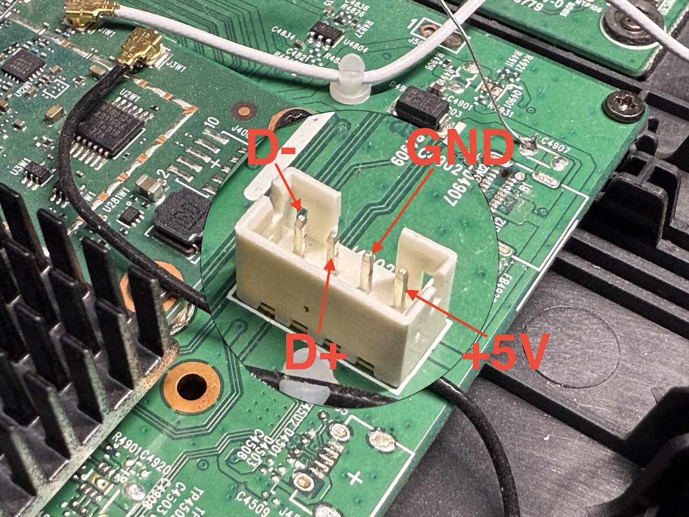

# Reutilización de Movistar Home - RG3205W

como un panel de dashboard para Home Assistant.

**Este documento solo está destinado al modelo `RG3205W` con un SoC arm64 de Qualcomm. Para el modelo `IGW-5000A2BKMP-I v2` con una CPU x86 de Intel, por favor consulta [IGW5000/README.md](../IGW5000/README.md). [_¿Cómo identificarlo?_](../README.md#nota-importante)**

[🇺🇸 English version](./README.en.md)

## Especificaciones

| | |
| --- | --- |
| SoC | Qualcomm Snapdragon 625 (8C8T, Cortex-A53) @ 1,80 GHz |
| OS | Android 8.1.0, kernel 3.18.71-perf, armv7l (32-bit) en lugar de aarch64 |
| RAM | 3 GB |
| Almacenamiento | 32 GB |
| Pantalla | 8 pulgadas 1280x800 con pantalla táctil de I2C de Goodix |
| Wi-Fi & Bluetooth | Qualcomm QCA9379 |
| Altavoces | 2 x 5 W (SPL 87 dB @ 1 W \| 1 m) |
| Micrófonos | 4 micrófonos omnidireccionales con DSP dedicado |
| Cámara | OMNIVISION OV2735 con 2 megapíxeles |
| Medidas | 21,2 x 23,5 x 12,2 cm (alto x ancho x fondo) |
| Peso | 1,1 kg |

## Desmontaje

(Tiene un chasis idéntico al del [IGW5000](../IGW5000/README.md#desmontaje))

Para desmontar el dispositivo, suelta las **10 presillas** _("snap-fits")_ situadas bajo los bordes del panel trasero, teniendo cuidado de no dañarlas.

Luego retira los **8 tornillos** situados bajo el panel y los **4 tornillos** ocultos bajo la tira de goma negra en la parte inferior del dispositivo.

## Modificaciones solo por software

Para información sobre modificaciones solo por software con limitaciones, por favor consulta [rev5-softhacks/README.md](./rev5-softhacks/README.md).

## Flashear una ROM personalizada

> [!IMPORTANT]
> **TRABAJO EN PROGRESO**

Afortunadamente, el *bootloader* se puede desbloquear y permite arrancar cualquier ROM personalizada. Para hacerlo, puede que necesites fabricar un cable USB personalizado, dependiendo de la variante que tengas.

Actualmente existen al menos 2 variantes (revisiones de hardware) del RG3205W: `Rev4` y `Rev5`.

> [!IMPORTANT]
> Para identificar las 2 variantes, **la única forma fiable** es retirar el panel posterior y comprobar las marcas en la placa o la presencia del conector USB Tipo-C.
>
> Se han reportado varias excepciones sobre la fecha de fabricación "F.Fab(AAMM)" en la etiqueta adhesiva, por ejemplo, `2001` puede ser Rev4 o Rev5.

#### Rev4

Si el tuyo tiene una placa `Rev4`, ¡eres muy afortunado! Ya viene con un conector USB Tipo-C hembra soldado y completamente funcional. Solo tienes que conectar un cable normal entre él y tu PC.

#### Rev5

Por desgracia, la variante más común en el mercado es la `Rev5`, que no viene con el conector USB Tipo-C populado.

Sin embargo, el conector JST-PH2.0 blanco hembra de 4 pines que se encuentra cerca también está conectado a los 4 pines de USB 2.0, con el pinout de izquierda a derecha: `D-`, `D+`, `GND`, `+5V`, puedes usarlo para sacar la conexión USB sin necesidad de soldar un conector SMD de USB Tipo-C (lo cual es muy difícil de hacer).

Puedes fabricar un cable personalizado sencillo utilizando un conector JST-PH2.0 macho o un [_pin header_](https://en.wikipedia.org/wiki/Pin_header) hembra de 4 pines con paso de 2,0 mm.

### Modo EDL

> [!IMPORTANT]
> Se recomienda utilizar el [modo EDL de Qualcomm](https://en.wikipedia.org/wiki/Qualcomm_EDL_mode) para realizar primero un volcado completo de la memoria flash, para que puedas restaurarlo a su estado original si algo sale mal.

Puedes hacer que el dispositivo entre en modo EDL cortocircuitando los pines `D+` y `GND` del USB (por ejemplo, usando un cuchillo metálico o unas pinzas) mientras conectas el cable de alimentación, manteniendo durante 3 segundos antes de soltar.

A continuación, puedes usar la herramienta [QPST de Qualcomm](https://qpsttool.com/) en Windows, o mejor aún, la herramienta [edl](https://github.com/bkerler/edl) de B.Kerler (multi-plataforma) para volcar y flashear la ROM.

También hay unos volcados de ROM original aportados por la comunidad disponibles en la sección [Recursos](#recursos) más abajo.

> [!CAUTION]
> Procede con extrema precaución al flashear ROMs personalizadas, ya que podrías dejar el dispositivo inutilizable _(brickearlo)_.
>
> Solo deberías tocar las particiones `boot`, `recovery`, `system` y `vendor`, y borrar `userdata` y `cache` después de flashear.
>
> **NUNCA TOQUES** las demás particiones, ya que pueden contener el *bootloader*, firmware u otros datos específicos del dispositivo, como direcciones MAC, IMEI, datos de calibración, etc.

### Desbloquear el bootloader

Instala las [Android SDK Platform Tools](https://developer.android.com/tools/releases/platform-tools) en tu PC para obtener los comandos `adb` y `fastboot`.

Conecta el dispositivo al PC mediante USB, mantén pulsados los botones de volumen "-" (bajar) y encendido hasta que aparezca la pantalla azul con el logo blanco de Movistar y luego se desaparezca a una pantalla negra. En ese momento el dispositivo habrá arrancado en el modo *fastboot*.

Al ejecutar `fastboot devices` deberías ver que el dispositivo está conectado.

Ejecuta `fastboot flashing unlock` y luego `fastboot oem unlock` para desbloquear el *bootloader*.

### Flashear particiones

Ahora puedes flashear imágenes modificadas a las particiones usando el comando
`fastboot flash <partición> <fichero-imágen>`. Por ejemplo, `fastboot flash system system.bin`.

Este repositorio ofrece una ROM personalizada basada en la ROM original [`ES_g1.0_RG3205W3.7.0_202209282206`](https://github.com/zry98/movistar-home-hacks/tree/main/RG3205W/stock-rom-dumps/ES_g1.0_RG3205W3.7.0_202209282206), con todas las aplicaciones preinstaladas innecesarias eliminadas, algunas apps útiles añadidas y unas optimizaciones para mejorar el rendimiento y alargar la vida útil del disco eMMC. Puedes encontrarla en la página de [Latest Release](https://github.com/zry98/movistar-home-hacks/releases/latest).

Después de flashear, ejecuta `fastboot erase userdata` y `fastboot erase cache` para borrar las particiones de datos de usuario y caché.

Finalmente, ejecuta `fastboot reboot` para reiniciar el dispositivo a la ROM personalizada.

## Recursos

- [Volcado parcial de la ROM original de Rev4](https://github.com/zry98/movistar-home-hacks/tree/main/RG3205W/stock-rom-dumps/ES_g1.0_RG3205W1.2.4_201912112049) usando ADB, hecho por _Cansi_ en nuestro grupo de Telegram
- [Volcado de la ROM original de Rev5](https://github.com/zry98/movistar-home-hacks/tree/main/RG3205W/stock-rom-dumps/ES_g1.0_RG3205W3.7.0_202209282206) usando el modo EDL, hecho por _P4blo24_ en nuestro grupo de Telegram
