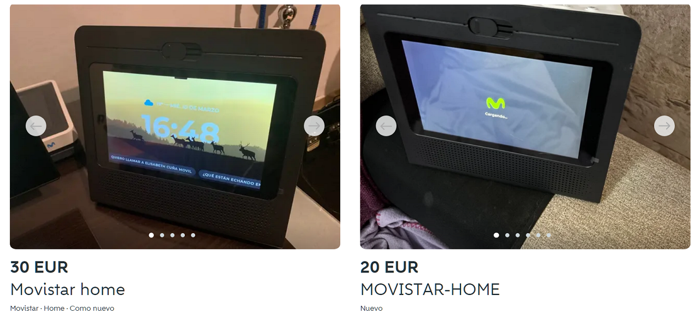
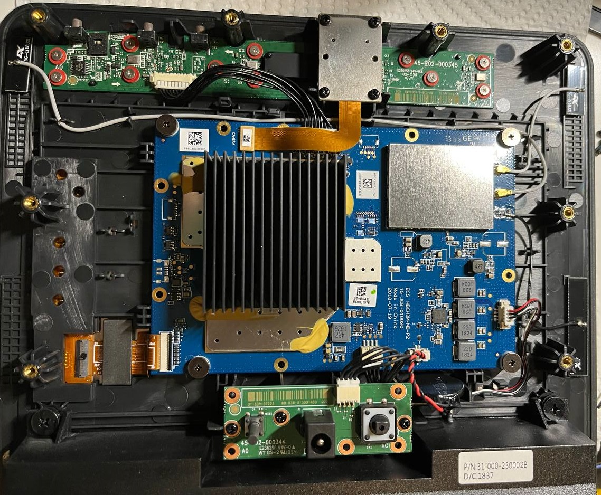
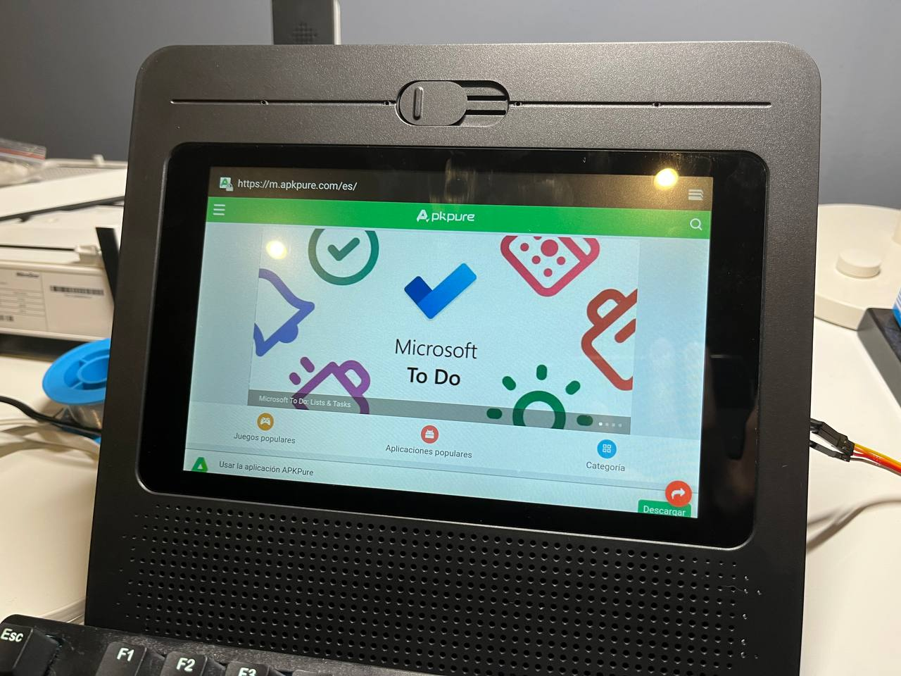
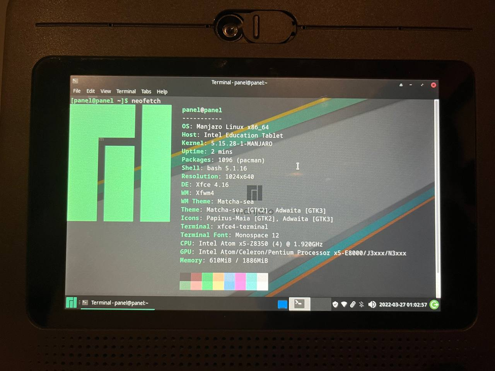
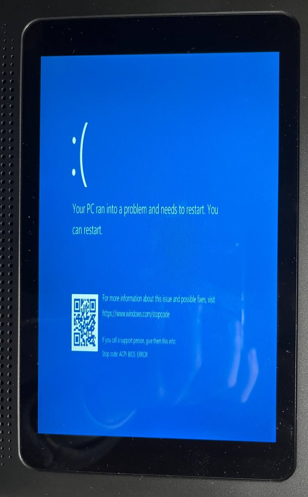

# Research notes

## Background

Recently while I was lurking around on Wallapop, the Spanish Craiglist, one item caught my attention:

This is Movistar Home, a smart home hub from Spain's biggest ISP, Telefónica Movistar. It's basically a smart speaker with a touch screen and built-in AI assistant (called Aura), something like Amazon Echo Show and Google Nest Hub. But it's well-integrated with the other products in Movistar's ecosystem, including controlling TV, WiFi, IoT devices (which I didn't find any detailed information). It can also play movies, TV series, music, and games on the device itself, but I doubt the user experience would be satisfying on that 8-inch screen.

I've always wanted to have a Home Assistant dashboard panel like everyone on /r/homeassistant with [wall-mounted tablets](https://www.reddit.com/r/homeassistant/search/?q=wall%20mount&restrict_sr=1), but I feel like something that sits on the desk would suit my use cases better, also I don't want to install something possibly permanent on the wall.

After searching around, I couldn't find any useful information about hacking this device. A [video](https://youtu.be/iGtNBYPh-mg?t=72) published on YouTube gave a glance of its virtual keyboard, which is obviously a Gboard on Android. And according to the [official website](https://www.movistar.es/particulares/movil/moviles/movistarhome#GW_masCaracteristicas) it has a CPU from Intel, which should be one of the Atom series widely used in Android & Windows tablets, so it seems like it's basically a tablet running Android-x86, not something too bizarre.

Tempted by the cheap price, I bought one for only 15 euros from a nice dude, including that wireless handset.

## Trying to break out

When I first powered it up, it asks me to connect to a Wi-Fi, but I couldn't find mine in the list, and it specifically said "Connect you to a **Movistar** Wi-Fi".

I tried to setup an AP with SSID and MAC address copied from the ones in the list, but it never showed up, even after reboot.

Since I couldn't find a way to continue, I had to dissasemble it:

The top green PCB has the four microphones, mute button and speaker volume buttons; the central blue PCB is the motherboard, with Wi-Fi & Bluetooth module in the upper right corner, speaker amplifier circuit in the bottom right corner, and CPU + RAM + eMMC + other stuff all inside an EMI shield under that big heat sink; the bottom green PCB has the reset button, 12V DC power jack and power button.

On the motherboard, there are two unpopulated 6-pin connector pads which I don't know what they are; a serial port (the 3 pads above the 6-pin connector on the left edge) with output of boot logs.

What really seemed useful was the unpopulated micro USB port pad on the left edge:

I soldered a cable with a standard USB female connector to it, and shorted the fourth pin (or the `ID` pad above) to ground, which made the device as OTG host.

After that, I connected a USB keyboard and tried to escape from the kiosk mode, but the only useful finding was bringing up the browser with `Win` + `B`, although it's unable to access any website since not connected to Wi-Fi.

Then I connected a USB hub with a USB ethernet adapter, now it's connected to the Internet:

I was able to download APKs but couldn't find a way to install them. I could read local files using the `file://` protocol (e.g. `file:///system/build.prop`) but when I try to open an APK file with `file:///sdcard/download/xxx.apk` it only gives me a toast saying that such files can only be accessed with HTTP(S) protocol.

#### easycwmp

I scanned the open ports on the device, found a HTTP service of `easycwmp` listening on port 7547, but it's protected with basic authentication. Later in the flash dump I found its credentials should be `easycwmp/easycwmp`, but it won't boot into the original Android-x86 after I wrote the dump back. [easycwmp](https://github.com/pivasoftware/easycwmp) is a [TR-069](https://en.wikipedia.org/wiki/TR-069) client, which usually should only appear in ISP-provided modems and routers, my guess here is that it's for the OS's OTA updates. That means it might be possible to take advantage of this service and flash custom firmware (Linux) **without having to disassemble the device and solder USB cable**. But unfortunately, I no longer have one with the original OS to do research on it.

So far nothing useful, so I decided to try to get into the BIOS setup which I believe it should have one since it's x86.

## Into the BIOS

I tried pressing several different keys on startup, `F12` got me a black screen with a text `DNX FASTBOOT MODE...`, and `F2` got me into the BIOS (well actually it's UEFI-only):

From there, I was able to boot Linux normally from a USB drive:

For Windows, it always gives me a BSOD with stop code `ACPI_BIOS_ERROR` whatever version I try (Win7 & Win10 installer, WinPE and WindowsToGo). But anyway I don't think it's a good idea running Windows on that poor 2 GB RAM.

